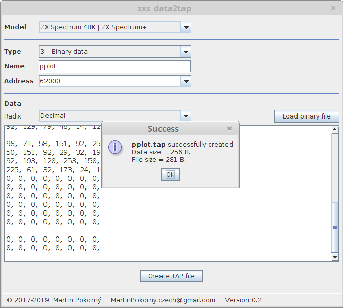

zxs_data2tap
============

This program encapsulates binary data to a single block in a TAP file for [ZX Spectrum](https://en.wikipedia.org/wiki/ZX_Spectrum) emulators. Binary data is always stored as a type 3 block. Typical data is a loading screen, machine code routines, graphics (UDG, sprites, custom font).

Be sure you understand how TAP format works (at least roughly). The good start is, for example, an article on [faqwiki.zxnet.co.uk](https://faqwiki.zxnet.co.uk/wiki/TAP_format).

Note: This tool isn't designed to convert BASIC source code to the TAP file. For that purpose, there is a nice tool called **bas2tap** (see [bas2tap mirror](https://github.com/andybalaam/bas2tap)) by Martijn van der Heide.

-----

### Requirements

- Java 7 or newer

### How to built

1. install *Java SE Development Kit (JDK)*, install *Apache Maven*
2. install *Netbeans IDE*
3. open project in *Netbeans*.
4. be sure you are connected to the Internet
5. from menu "Run" select "Clean and Build Project (Shift-F11)"
6. wait until *maven* download all dependencies and plugins. Then *maven* will create build.
7. result should be in directory: *target/dist-package*

- Note: instead of steps 2, 3, 5 you can simply run this command:  `mvn package`

### Run

Use added scripts or try to run from command line:

```BASH
java -jar zxs_data2tap.jar --help
```

-----

### Screenshot


