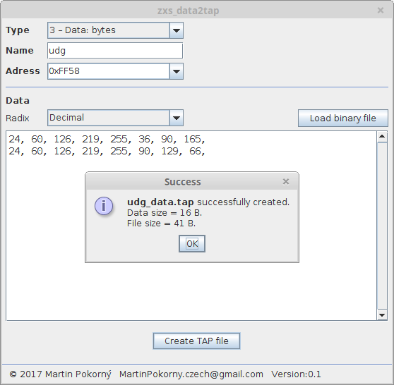

zxs_data2tap
============

This program creates TAP file for ZX Spectrum with specific binary data. Data are typically: loading screen, UDG, custom font, machine code routines, application data.

For more information about ZX Spectrum see article
[ZX Spectrum on wikipedia](https://en.wikipedia.org/wiki/ZX_Spectrum).

See also [ZX Spectrum memory map](http://www.breakintoprogram.co.uk/wp-content/uploads/2012/07/table_spectrum_memory_map.png)
and [article about TAP format on faqwiki.zxnet.co.uk ](https://faqwiki.zxnet.co.uk/wiki/TAP_format).

-----

### Requirements
- Java 7 or newer

### How to built
1. install *Java SE Development Kit (JDK)*, install *Apache Maven*, install *Netbeans IDE*
2. open project in *Netbeans*.
3. be sure you are connected to the Internet
4. select "Clean and Build Project (Shift-F11)" in menu "Run".
5. wait until *maven* download all dependencies and plugins. Then *maven* will create build.
6. result should be in directory: *target/dist-package*.

-----

### Example of use

Imagine you want to create a simple program in BASIC for ZX Spectrum. You want to use a fancy *loading screen* and you need to use *UDG (User Defined Graphics)*.

There are a several file formats in the world of ZX Spectrum. For BASIC programs is TAP format perfect. See [article about TAP format on faqwiki.zxnet.co.uk ](https://faqwiki.zxnet.co.uk/wiki/TAP_format).

You can assemble your program into TAP following these steps:

1. create a BASIC loader. A short BASIC program like this one:

    ```BASIC
    10 PAPER 0: BORDER 0: INK 7: FLASH 0: INVERSE 0: OVER 0: BRIGHT 0: CLS
    20 LET udg = PEEK 23675 + 256 * PEEK 23676 : REM .. Adress of UDG section in RAM (see system variables ...)
    40 LOAD ""SCREEN$ : REM .. for loading_screen
    50 LOAD ""CODE udg : REM .. for udg_data
    60 LOAD "" : REM .. for main_basic_program
    ```
    Save the file as *basic_loader.bas*

2. create TAP file from *basic_loader.bas* using *bas2tap* ([bas2tap mirror](https://github.com/andybalaam/bas2tap))

    ```
    bas2tap -a10 -sMyProg basic_loader.bas
    ```

    options:

      - -a&lt;auto-start_line_num&gt;
      - -s&lt;name_in_header&gt;

3. prepare loading screen in SCR format.

    Here are several different options how to create SCR. For example you can use:

    - [ZX-Paintbrush](http://www.zx-modules.de/zxpaintbrush/zxpaintbrush.html) (only for Windows)
    - a *ZX Spectrum emulator* (for example *[JSpeccy](https://github.com/jsanchezv/JSpeccy)*) with your favorite image editor for ZX Spectrum (for example [Art Studio](http://www.worldofspectrum.org/infoseekid.cgi?id=0007915)). Paint your loading screen and then select *Save screenshot...* from emulator menu.
    - your favorite image editor (for example *GIMP*). Export image to PNG and then convert result to SCR using *[png2scr](https://github.com/reidrac/png2scr)*. Good for simple loading screens.    
    - ...    

    Save file as *loading_screen.scr*.

4. wrap *loading_screen.scr* to TAP using **zxs_data2tap**.

    Load *loading_screen.scr*; Set adress to value 0x4000. Save file as *loading_screen.tap*.

5. prepare UDG data using *[zxs_udg_editor](https://github.com/mosaicmap/zxs_udg_editor)*

6. wrap UDG data to TAP using **zxs_data2tap**.

    Paste data from clipboard to the data text area. Save file as *udg_data.tap*.

7. create TAP from main BASIC program using *bas2tap* ([bas2tap mirror](https://github.com/andybalaam/bas2tap))

    ```
    bas2tap -a10 -sMain main_basic_program.bas
    ```

8. merge all parts to the final TAP file

    Due to the structure of the TAP format, TAP files can be concatenated into a single TAP file (See [article about TAP format on faqwiki.zxnet.co.uk ](https://faqwiki.zxnet.co.uk/wiki/TAP_format)).

    You have prepared:

    - basic_loader.tap
    - loading_screen.tap
    - udg_data.tap
    - main_basic_program.tap

    Finally merge all parts using command:

    - on Unix-like system:
    ```
    $ cat basic_loader.tap loading_screen.tap udg_data.tap main_basic_program.tap > my_program_for_zxs.tap
    ```    
    - on MS Windows:
    ```
    > copy /b basic_loader.tap + loading_screen.tap + udg_data.tap + main_basic_program.tap  my_program_for_zxs.tap
    ```

    Result is *my_program_for_zxs.tap*

9. Test the *my_program_for_zxs.tap* in your ZX Spectrum emulator       

10. create a build script (or a batch file) or use some build tool like *make* or *ant* or *maven* or ...

-----

### Screenshot


